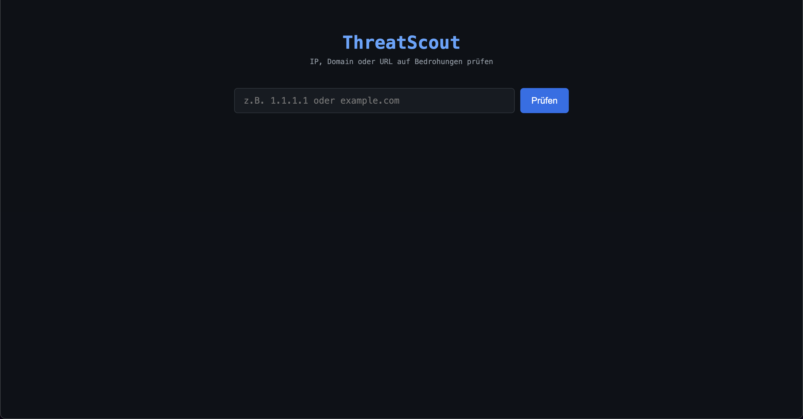
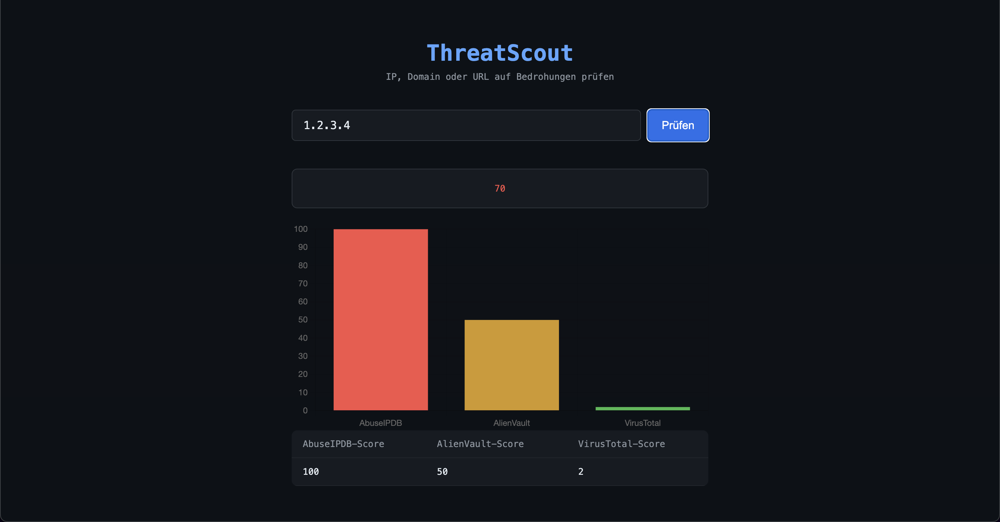

# ThreatScout

A threat intelligence dashboard that checks IP addresses, domains, and URLs against multiple security databases and calculates a risk score.

## Screenshots

**Before:**



**After:**



## How it works

1. Enter an IP address, domain, or URL
2. Flask queries three threat intelligence APIs in parallel
3. A risk score (0–100) is calculated from the results
4. The dashboard displays the score, a bar chart, and a detail table

## Tech Stack

| Layer | Technology |
|-------|-----------|
| Backend | Python, Flask |
| APIs | AbuseIPDB, AlienVault OTX, VirusTotal |
| Frontend | HTML, CSS, JavaScript |
| Chart | Chart.js |

## APIs

| API | What it checks |
|-----|---------------|
| [AbuseIPDB](https://www.abuseipdb.com) | Reported malicious IPs |
| [AlienVault OTX](https://otx.alienvault.com) | Community threat reports |
| [VirusTotal](https://www.virustotal.com) | 80+ antivirus engine results |

## Score

| Score | Risk level |
|-------|-----------|
| 0–29 | 🟢 Low |
| 30–69 | 🟡 Medium |
| 70–100 | 🔴 High |

## Setup

1. Clone the repository
2. Create a virtual environment and install dependencies:
```bash
pip install flask requests python-dotenv
```

3. Create a `.env` file with your API keys:
```
ABUSEIPDB_KEY=your_key
OTX_KEY=your_key
VIRUSTOTAL_KEY=your_key
```

4. Run the app:
```bash
python app.py
```

5. Open `http://127.0.0.1:5000` in your browser
